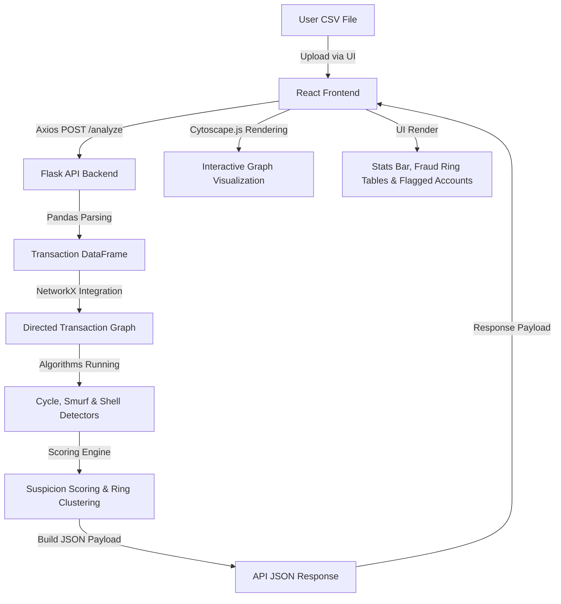

# Money Muling & Fraud Ring Detection System

An advanced, graph-based anti-money laundering (AML) and financial intelligence platform designed to detect money muling networks, fraud rings, and suspicious financial transaction patterns in real-time. By leveraging graph theory and network analysis, the system models transactions as directed graphs to expose hidden structural anomalies that traditional rule-based engines miss.

---

## 🚀 Key Features

*   **Graph-Based Financial Modeling:** Turns transactional datasets (CSV) into directed graphs of financial flow (accounts as nodes, transactions as edges).
*   **Multi-Pattern Detection Algorithms:**
    *   **Cycle Detection:** Tracks cyclic transaction loops (e.g., $A \rightarrow B \rightarrow C \rightarrow A$) commonly used for layering and laundering transaction history.
    *   **Smurf & Fan Anomaly Analysis:** Automatically identifies "Fan-In" (many-to-one aggregation) and "Fan-Out" (one-to-many distribution) patterns indicative of structured deposits/muling.
    *   **Shell Chains:** Traces long, multi-hop transaction chains designed to obscure the original source of illicit funds.
*   **Suspicion Scoring Engine:** Combines structural graph anomalies and transactional frequencies into a normalized, multi-variable suspicion score for each account.
*   **Fraud Ring Clustering:** Groups suspicious nodes into interconnected criminal networks (Fraud Rings) using community discovery techniques.
*   **Interactive Network Visualization:** Utilizes **Cytoscape.js** to render a dynamic, interactive force-directed graph of the transaction networks, highlighting nodes by risk score and ring membership.
*   **Actionable Dashboard UI:** Displays summary statistics, interactive visual graphs, identified fraud rings list, flagged account tables, and CSV exports of the reports.

---

## 🛠️ Technology Stack

### Backend (Data & Algorithms)
*   **Python:** Core pipeline execution and algorithm implementation.
*   **Flask:** Lightweight API server exposed at `http://localhost:5001`.
*   **NetworkX:** Core graph-theory library used to model and analyze the transactions network, calculate cycles, and traverse paths.
*   **Pandas & NumPy:** Fast data-frames manipulation to parse CSV inputs, filter anomalies, and pre-aggregate transaction attributes.

### Frontend (User Interface)
*   **React.js (Vite):** A fast, component-based modern SPA architecture.
*   **Cytoscape.js & React-Cytoscapejs:** Highly optimized network graph rendering library used to display nodes, edges, force-directed layouts, and interactive zooms/drags.
*   **Tailwind CSS:** Modern utility-first CSS styling featuring a premium, futuristic dark-theme interface with active micro-animations.
*   **Axios:** Asynchronous HTTP client for fast backend API integrations.

---

## ⚙️ Architecture & Data Flow



1.  **Ingestion:** The user uploads a CSV file containing transaction records (`sender_id`, `receiver_id`, `amount`, `timestamp`).
2.  **Processing:** Pandas cleans and compiles the transactions, and NetworkX compiles the nodes (accounts) and directed edges (transfers).
3.  **Analysis:** The detectors scan the network topology to isolate loops, shells, and fans.
4.  **Scoring & Assembly:** The `scoring_engine.py` assigns threat values. The `ring_builder.py` clusters nodes into logical fraud units.
5.  **Visualization:** The UI renders tables alongside a highly performant Cytoscape graph network, colored dynamically by suspicion levels (green/low to red/critical).

---

## 💻 Getting Started

### Prerequisites
*   Python 3.10+
*   Node.js 18+ & npm

### 1. Setup Backend
1.  Navigate to the `backend/` directory:
    ```bash
    cd backend
    ```
2.  Create and activate a virtual environment:
    ```bash
    python3 -m venv venv
    source venv/bin/activate  # On Windows: venv\Scripts\activate
    ```
3.  Install dependencies:
    ```bash
    pip install -r requirements.txt
    ```
4.  Run the Flask API Server:
    ```bash
    python main_api.py
    ```
    *The backend server will run on `http://127.0.0.1:5001`.*

### 2. Setup Frontend
1.  Navigate to the `frontend/` directory:
    ```bash
    cd ../frontend
    ```
2.  Install dependencies:
    ```bash
    npm install
    ```
3.  Run the Vite development server:
    ```bash
    npm run dev
    ```
    *The frontend will be available at `http://localhost:5173` (or the port specified by Vite).*

---

## 📊 Sample Dataset Format

To test the system, your CSV data should contain the following headers:
```csv
sender_id,receiver_id,amount,timestamp
ACC_101,ACC_102,500.0,2026-04-26T10:00:00Z
ACC_102,ACC_103,450.0,2026-04-26T10:15:00Z
ACC_103,ACC_101,480.0,2026-04-26T10:30:00Z
```
*(A pre-packaged sample dataset is provided in `backend/transactions.csv` and `backend/fraud_1000.csv`.)*

---

## 🛡️ License

This project is licensed under the MIT License.
